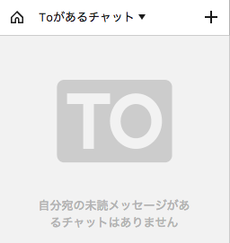
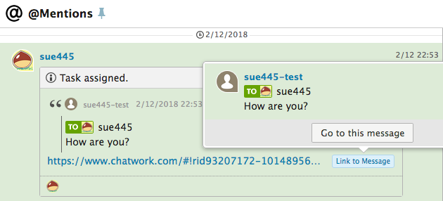
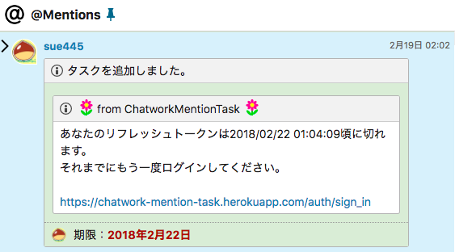
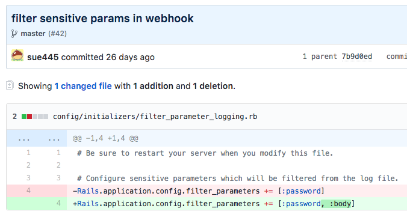
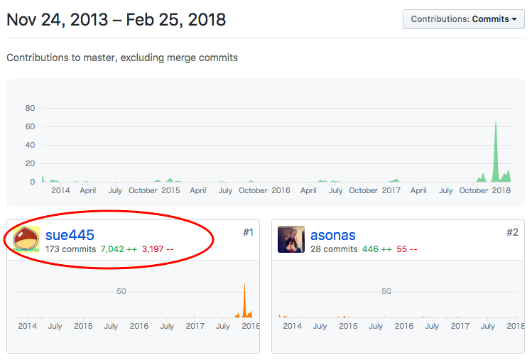
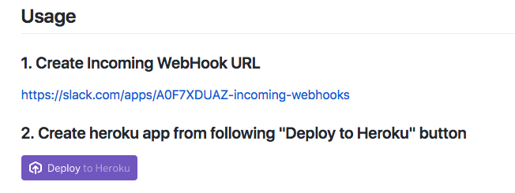

# ChatWorkMentionTaskを作った
sue445

2018/02/26 [Meguro.rb#12](https://megurorb.connpass.com/event/78332/)

https://github.com/sue445/megurorb-12

---
## 自己紹介 [](https://twitter.com/sue445)

* [@sue445](https://twitter.com/sue445)
* 最近はTerraformと戦う日々
* 去年は尿管結石が3〜4回できたり、持病が悪化して入院したり、親が死んで喪主やったりと色々と大変だったので今年は平穏に生きたい

---
## 今回話すこと
* 趣味アプリと副産物の宣伝

---

## ChatWorkMentionTaskとは
* https://chatwork-mention-task.herokuapp.com/
* 自分宛のメンションを既読にすると後から見返す手段がなくて不便なので、Slackの `@` 的なやつが欲しくて作った



---

### 動作風景
* 自分宛にきたメンションが自動的に別部屋にタスク化され、一覧表示される
* 重要なものや後で対応必要なものだけ残して、それ以外のタスクを完了にする運用



---

### 所感
* 半月くらい人柱運用してるけど日々の仕事がむっちゃ捗ってる！！！
* ぶっちゃげChatWork本体に欲しい機能なんだが、[3年前から要望は出ている](http://feedback-ja.chatwork.com/forums/269086-chatwork-%E3%81%94%E6%84%8F%E8%A6%8B-%E3%81%94%E8%A6%81%E6%9C%9B%E3%83%95%E3%82%A9%E3%83%BC%E3%83%A9%E3%83%A0/suggestions/7575039-to%E4%B8%80%E8%A6%A7%E6%A9%9F%E8%83%BD) がいまだに実装されていないので諦めて自分で作った

---

### 技術的なこと
* https://github.com/sue445/chatwork_mention_task
* ChatWork以外はいつものやつ
  * Ruby 2.5.0
  * Rails 5.2.0.rc1
  * Bootstrap 4.0.0
  * ChatWork (API, OAuth, Webhook)

---

### 仕組み
1. ChatWorkMentionTaskにChatWorkのアカウントでOAuth認証
2. ChatWorkの自分のアカウントにChatWorkMentionTaskのwebhookを登録
3. メンションがきたらwebhookが飛んできてタスク化される

---

### 頑張ったこと
ChatWorkのAPIのリフレッシュトークンの有効期限は2週間なので、リフレッシュトークンが切れる3日前にリマインド用にタスクを作るようにした



---
webhookの `params[:body]` にチャット本文が入っていて、それがログに出るのが嫌だったのでパスワード同様フィルタリングするようにした。


---



https://github.com/sue445/chatwork_mention_task/commit/ec3e2583044e2c132ef1de9ef0c656f1e74dcac1

---

## 副産物の紹介
* omniauth-chatwork :gem:
* chatwork :gem:
* chatwork_webhook_verify :gem:
* dockerfile-heroku-cli :whale:
* dockerhub-slack-webhook :whale:

---

## omniauth-chatwork :gem:
https://github.com/sue445/omniauth-chatwork

* ChatWorkのOAuth認証に対応したomniauthのprovider
* 詳しいこと: [omniauth-chatworkを作った](http://sue445.hatenablog.com/entry/2017/11/16/172724)

---
### 実際の設定
Railsだとこんな風に書いておくだけでいい感じにChatWorkのOAuth認証が使えるようになる

```ruby
# config/initializers/omniauth.rb
Rails.application.config.middleware.use OmniAuth::Builder do
  provider :chatwork, ENV["CHATWORK_CLIENT_ID"], ENV["CHATWORK_CLIENT_SECRET"], scope: ["users.profile.me:read", "rooms.tasks:write", "rooms.info:read"]
end
```

https://github.com/sue445/chatwork_mention_task/blob/10dd0c197060fbc62016fe33b60a2089dfb74261/config/initializers/omniauth.rb

---

## chatwork :gem:
https://github.com/asonas/chatwork-ruby

* omniauth-chatworkでOAuth認証できてもAPIでアクセストークンが使えないと意味がないのでchatwork gemのOAuth対応をした
* 他にいろいろPR送りまくってたら気づいたらメンテナになってた
  * [chatwork-rubyのメンテナにsue445さんを迎えました。 - 良いあそなすちゃん](http://asonas.hatenablog.com/entry/2017/12/04/035700)

---

### やったこと


---

### 頑張ったこと
* ChatWorkが公開してるAPIのスキーマ(raml)を使ってrspecのテストデータを自動生成するようにした
* https://github.com/asonas/chatwork-ruby のsubmoduleに https://github.com/chatwork/api を追加してramlを使えるようにしている

---
#### 実際のテストコード
* `stub_chatwork_request` と `it_behaves_like :a_chatwork_api` でramlを利用
* APIクライアントではテストデータの生成が面倒なのでそこを公式が提供しているデータを使って自動化できて便利

```ruby
describe ".create", type: :api do
  subject { ChatWork::Message.create(room_id: room_id, body: body, &block) }

  let(:room_id) { 123 }
  let(:body)    { "Hello ChatWork!" }

  before do
    stub_chatwork_request(:post, "/rooms/#{room_id}/messages", "/rooms/{room_id}/messages")
  end

  it_behaves_like :a_chatwork_api, :post, "/rooms/{room_id}/messages"
end
```

https://github.com/asonas/chatwork-ruby/blob/v0.8.0/spec/lib/chatwork/message_spec.rb#L24-L35

---

## chatwork_webhook_verify :gem:
* https://github.com/sue445/chatwork_webhook_verify
* ChatWorkのwebhookの署名を検証するためのgem
* Railsだと `before_action` から呼んでやるだけでOK :ok_woman:

```ruby
# app/controllers/webhook_controller.rb
class WebhookController < ApplicationController
  before_action :verify_chatwork_webhook_signature!
end
```

---

リクエストごとにtokenを変えて検証する必要がある場合はこんな感じ

```ruby
class WebhookController < ApplicationController
  before_action :set_user
  before_action :verify_signature!

  private

    def verify_signature!
      return unless Global.app.verify_signature?

      verify_chatwork_webhook_signature!(@user.webhook_token)
    end
end
```

https://github.com/sue445/chatwork_mention_task/blob/10dd0c197060fbc62016fe33b60a2089dfb74261/app/controllers/webhook_controller.rb

---

### dockerfile-heroku-cli :whale:
* https://github.com/sue445/dockerfile-heroku-cli
* https://hub.docker.com/r/sue445/heroku-cli/
* CircleCIからherokuにデプロイする時に毎回 [heroku/cli](https://github.com/heroku/cli) をダウンロードしたくなかったのでインストール済のイメージを作った
* alpineに必要最低限のパッケージやバイナリしか入れてないので47MBしかない超軽量イメージ
  * Docker Hubを検索してると似たようなイメージを作ってる人はたくさんいるけど、自分が見た範囲では `sue445/heroku-cli` が最軽量

---

#### 頑張ったこと
常に最新のheroku/cliをDockerイメージで使いたかったので、heroku/cliの更新を自動検知してDockerイメージを自動ビルドする仕組を作った

1. CircleCIのスケジューラが週1で起動
2. heroku cliのバージョンが上がっていればCircleCIがファイルをコミットしてGitHubにpush
3. GitHubにpushされればDocker Hubの [automated builds](https://docs.docker.com/docker-hub/github/) でビルドがされる

https://github.com/sue445/dockerfile-heroku-cli/blob/fd4517b1b252e182d7b318fed74fe95fbe79e782/.circleci/config.yml#L64-L79

---
### dockerhub-slack-webhook :whale:
* https://github.com/sue445/dockerhub-slack-webhook
* Docker Hubでビルドした後にSlackに通知するためのwebhook
* ビルドしたイメージがいつビルド終わるか分からないので、Slackに手軽に通知できるようにしたかった


---

#### 頑張ったこと
Deploy to Herokuボタンに対応してるので、Herokuのアカウントさえあればワンクリックでデプロイできる



---

## まとめ
* ChatWorkを使ってる場合はChatWorkMentionTaskは便利なので是非使ってください
* RubyでChatWorkをハックする技術はだいたい制覇できた感あるｗ
